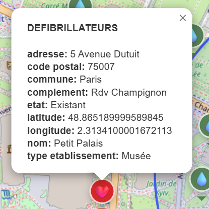
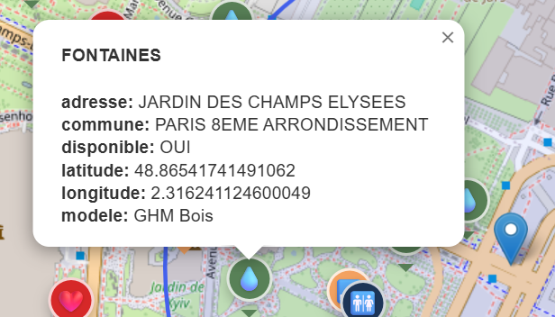
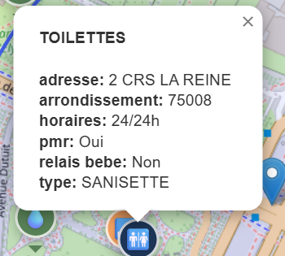
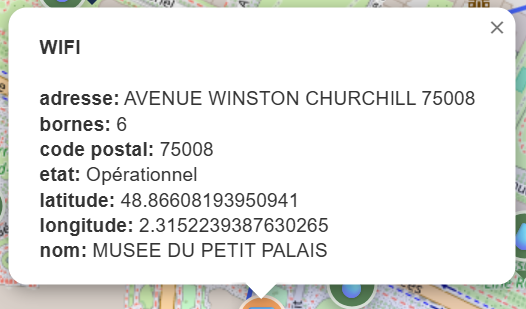

# Paris Open Data Services

Application Flask qui affiche sur une carte Leaflet les services gratuits disponibles à Paris (défibrillateurs, fontaines à boire, toilettes publiques, hotspots Wi-Fi). Les données sont téléchargées depuis le portail Open Data Paris, nettoyées puis stockées dans MongoDB Atlas avant d’être exposées via l’API Flask.


## Fonctionnalités

- Carte Leaflet interactive centrée sur Paris avec filtres par type de service.
- Recherche d’une adresse parisienne (Nominatim) et affichage des points les plus proches grâce à `$geoNear`.
- API REST simple : `/api/services` (GeoJSON pour chaque collection) et `/api/nearby`.
- Scripts prêts à l’emploi pour télécharger et charger automatiquement les jeux de données Open Data Paris.


### 🧭 Aperçu des informations affichées sur la carte

Les différents services publics de Paris (défibrillateurs, fontaines, toilettes et bornes WiFi) sont affichés sur la carte avec une icône dédiée.  
En cliquant sur un marqueur, une popup Leaflet s’ouvre avec les informations clés du point de service.

---
#### 🖼️ Exemples de popups

<div style="display: grid; grid-template-columns: repeat(2, 1fr); gap: 12px;">

  <div>
    
  </div>

  <div>
    
  </div>

  <div>
    
  </div>

  <div>
    
  </div>

</div>

---
#### 📝 Détails affichés dans chaque popup

##### ❤️ Défibrillateurs
- **adresse**  
- **code postal**  
- **commune**  
- **complément d'information**  
- **état de fonctionnement**  
- **latitude / longitude**  
- **nom du site**  
- **type d’établissement**  

##### 💧 Fontaines
- **adresse / localisation**  
- **commune**  
- **disponible : Oui / Non**  
- **latitude / longitude**  
- **modèle de la fontaine**  

##### 🚻 Toilettes
- **adresse complète**  
- **arrondissement**  
- **horaires d’ouverture**  
- **PMR : accessibilité handicapé**  
- **relais bébé**  
- **type (Sanisette, etc.)**  

##### 📶 WiFi
- **adresse complète**  
- **nombre de bornes**  
- **code postal**  
- **état (Opérationnel / Hors service)**  
- **latitude / longitude**  
- **nom du site**  

---

## Stack

- Flask, Jinja2, python-dotenv (`run.py`, `app/__init__.py`, `app/config.py`).
- MongoDB Atlas + `pymongo` + index géospatiaux (`scripts/load_data_to_mongo.py`, `app/routes.py`).
- Leaflet + JavaScript vanilla (`app/static/js/map.js`) et templates HTML (`app/templates/`).

## Structure du dépôt

```
app/                 # Config, routes, templates et assets
data/                # GeoJSON téléchargés (non versionnés)
scripts/             # fetch_paris_data.py + load_data_to_mongo.py
run.py               # Entrée Flask pour le dev local
requirements.txt     # Dépendances Python
.env                 # Secrets locaux (ignoré par git)
```

## Prérequis

- Python 3.10+ et `pip`.
- Accès à un cluster MongoDB Atlas (URI SRV, IP whitelistée).
- Optionnel : `virtualenv` ou `venv` pour isoler l’environnement.

## Installation

```bash
python -m venv .venv
# Windows
.venv\Scripts\activate
# macOS / Linux
source .venv/bin/activate

pip install -r requirements.txt
```

## Configuration

1. Copier `.env.example` vers `.env` (à créer si absent).
2. Renseigner vos propres valeurs :

```ini
FLASK_ENV=development
SECRET_KEY=change-me
MONGO_URI=mongodb+srv://<user>:<password>@<cluster>/<db>?retryWrites=true&w=majority
MONGO_TARGET_DB=paris_services_gratuit
MAP_DEFAULT_LAT=48.8566
MAP_DEFAULT_LNG=2.3522
MAP_DEFAULT_ZOOM=12
SERVICE_TYPES=defibrillateurs,fontaines,toilettes,wifi
```

- `MONGO_URI` est obligatoire : l’application lève une erreur explicite au démarrage si absent.
- `SERVICE_TYPES` limite les collections exposées par l’API (utile si vous n’importez pas tout).
- Personnalisez `MAP_DEFAULT_*` pour centrer la carte ailleurs si besoin.

## Importer les données Open Data

Dans un terminal avec l’environnement virtuel activé et la connexion Atlas valide :

```bash
python scripts/fetch_paris_data.py      # télécharge les GeoJSON dans data/
python scripts/load_data_to_mongo.py    # nettoie + charge dans MongoDB Atlas
```

Le script de chargement vide chaque collection avant insertion, ajoute longitude/latitude et crée un index `GEOSPHERE` utilisé par l’endpoint `/api/nearby`.

## Lancer l’application en local

```bash
python run.py
# ou via Flask CLI
flask --app run run --debug
```

Ouvrez http://127.0.0.1:5000 pour accéder à la carte. Endpoints disponibles :

- `/` : carte Leaflet (filtres, formulaire d’adresse, liste des services proches).
- `/api/services?type=<service>&limit=<n>` : GeoJSON (défibrillateurs, fontaines, etc.).
- `/api/nearby?lat=<lat>&lng=<lng>&limit=<n>` : recherche des services autour d’un point.

Vérifiez que votre IP est autorisée dans Atlas et que la base contient des documents avant de lancer le serveur.
